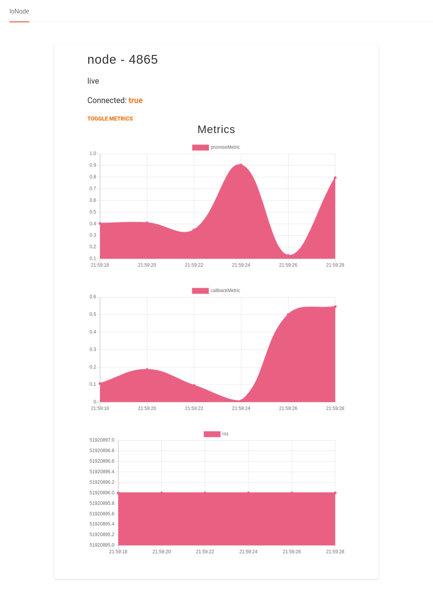

# IoNode - IoT Platform

IoNode is an IoT platform developed in the Node Advance Course at Platzi. In this project we developed several modules and connect them to monitor processes and store the metrics in a relational database.

#### Stack

- Node
- PostgreSQL
- Redis
- Aedes
- Svelte
- Sapper
- Jest

What I learned from make this project:

- Unit test
- Test Driven Development
- Integration Test
- Backend For Frontend

What challenges I face doing this project:

- Make all test suites with Jest because in the course is used Ava as test runner and sinon to make mocks and stubs, I want to implement all this stuff with Jest
- Implement Aedes as MQTT broker because mosca is an unmaintained project
- Front end UI was implemented with Vue and I want to try the implementation with Svelte framework and take advantage from the Sapper template to make it

_Please see modules folder to information detailed about each one_
